# Agentic BI 驱动的多表电商运营分析与决策智能系统项目报告

成员：2354283 黄迪、2351269 黄一和、2352048 夏浩博

## 摘要

本项目基于 Brazilian E-Commerce Public Dataset by Olist，构建了一个面向电商运营场景的 Agentic BI 系统。系统通过 Streamlit 提供自然语言交互界面，使用 LangGraph 编排多个智能体，连接 MySQL 中的 9 张原始业务表与 6 张预聚合视图，实现描述性分析、诊断性分析、预测性分析和规范性决策建议。系统支持月度销售趋势、州级销售分布、支付方式分析、配送表现、商品重量与运费关系、评论情感与主题建模、What-if 卖家筛选、异常检测和多轮关联分析。

在性能优化方面，项目将高频查询沉淀为预聚合视图层。以“2017 年各州销售额排名”为例，使用 `mv_state_sales` 的中位查询耗时为 30.49 ms，而基础表 `orders + order_items + customers` 实时 JOIN 的中位耗时为 363.98 ms，预聚合视图约快 11.94 倍，且两种查询结果完全一致。

## 1. 项目背景与动机

传统 BI 系统通常依赖固定报表和人工配置仪表盘。对于业务人员来说，当问题从“销售额是多少”进一步变成“为什么某些州配送慢”“哪些卖家拖累评分”“如果筛掉低评分卖家会怎样”时，传统报表往往需要数据人员重新写 SQL、制作图表、解释结果，响应链路较长。

Agentic BI 的核心思想是让大语言模型和多智能体系统主动参与业务分析流程：用户用自然语言提出问题，系统自动完成问题理解、任务拆解、SQL 查询、图表生成、预测建模、评论文本分析和决策建议生成。本项目选择 Olist 多表电商数据集，是因为它同时包含订单、商品、客户、卖家、支付、评论、地理位置等多个运营维度，能够充分体现多表 JOIN、预聚合视图、预测模型和文本洞察在电商运营分析中的价值。

本项目的目标包括：

- 支持非技术用户通过中文自然语言进行电商运营分析。
- 在 MySQL 中维护原始 9 张业务表和预聚合视图层，提高高频分析查询效率。
- 使用 LangGraph 构建多智能体协作流程，覆盖数据分析、NLP、预测、可视化、What-if、异常检测和决策建议。
- 自动生成不少于 6 类图表，并在 Web 页面中展示分析结果、原始 SQL 结果和业务建议。
- 通过性能对比证明预聚合视图层对 Agentic BI 交互式分析的加速效果。

## 2. 系统架构设计

系统整体采用“前端交互层 + Agent 编排层 + 数据查询层 + 可视化与决策层”的架构。用户在 Streamlit 前端输入自然语言问题后，Coordinator Agent 识别问题类型并生成任务计划，随后由 Data Analyst、NLP Insight、Predictor、Scenario、Visualizer 和 Decision Agent 协作完成分析。



图 1 展示了系统总体架构。系统中最关键的设计是数据层分为两部分：

- 原始 Olist 9 表：保留完整明细，用于无法被预聚合视图覆盖的细粒度问题。
- 预聚合视图层：对月度销售、州级销售、品类销售、配送表现、卖家绩效、支付方式等高频维度提前汇总，作为 Data Analyst Agent 的优先查询对象。

### 2.1 LangGraph Agent 调度流程

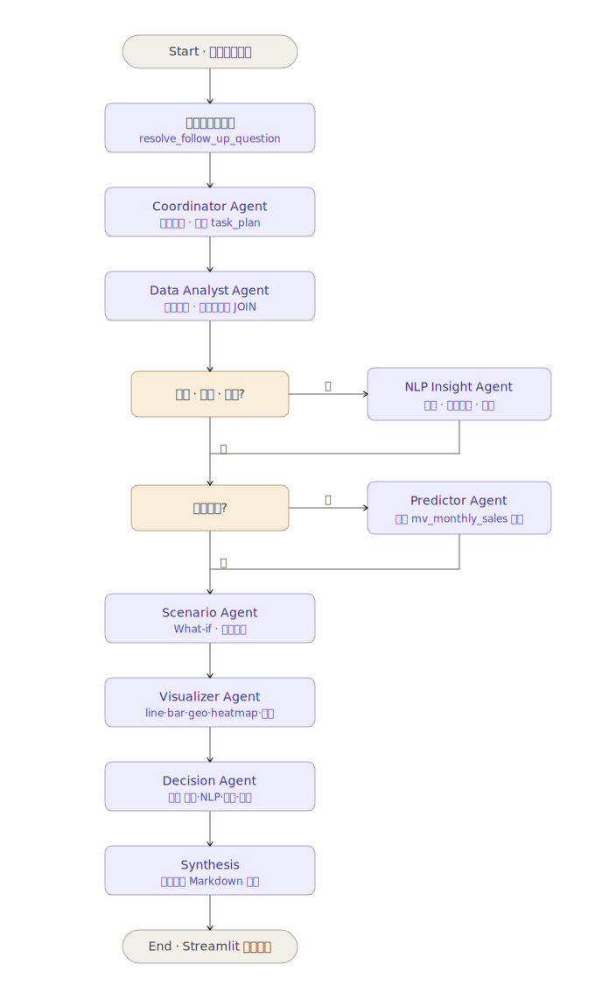

图 2 展示了 LangGraph 调度流程。系统从用户问题出发，先进行多轮上下文解析，再由 Coordinator Agent 进行任务规划。Data Analyst Agent 默认优先执行数据查询；若问题涉及评论、情感、主题，则触发 NLP Insight Agent；若问题涉及趋势预测，则触发 Predictor Agent；若问题涉及 What-if 或异常扫描，则触发 Scenario Agent。随后 Visualizer Agent 生成图表，Decision Agent 综合所有中间结果形成业务建议，最后由 Synthesis 汇总为页面回答。

### 2.2 预聚合视图层

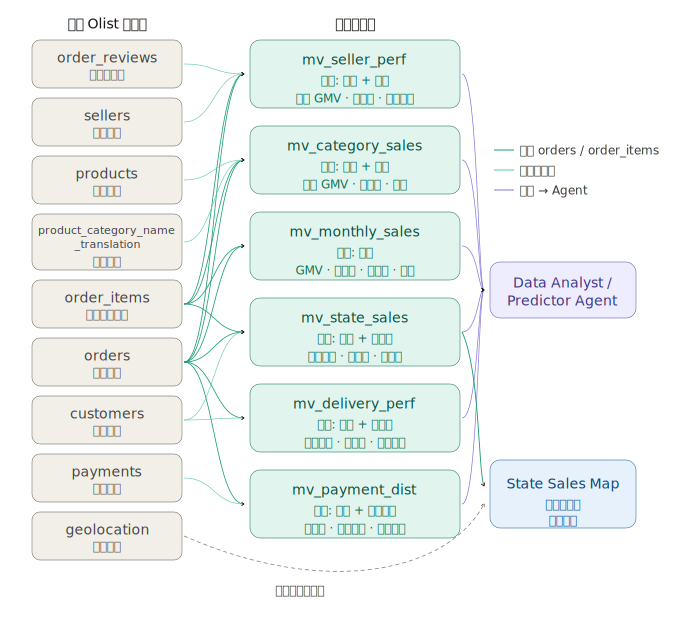

图 3 展示了原始表到预聚合视图层的映射。MySQL 没有原生物化视图机制，因此本项目使用可刷新汇总表实现物化预聚合视图：先 `DROP TABLE IF EXISTS`，再 `CREATE TABLE`，最后通过 `INSERT INTO ... SELECT ... GROUP BY` 从原始表生成汇总结果。

## 3. 关键技术选型说明

| 技术模块 | 选型 | 作用 | 选型原因 |
|---|---|---|---|
| LLM | DeepSeek `deepseek-chat`，OpenAI-compatible API | 问题理解、SQL 生成辅助、图表选择、决策建议生成 | 成本较低，支持长文本推理和 JSON 输出，方便接入 LangChain / LangGraph |
| Agent 框架 | LangGraph StateGraph | 多智能体编排、条件路由、共享状态传递 | 支持有状态图结构，适合多步骤 BI 分析流程 |
| Web 前端 | Streamlit | 提供左侧对话区、右侧图表与结果页签 | 开发效率高，适合课程项目快速实现可交互 BI 界面 |
| 查询引擎 | MySQL + SQLAlchemy + PyMySQL | 存储原始 9 表和预聚合视图，执行 SQL | 能体现多表 JOIN、聚合查询和视图加速效果 |
| 预测模型 | Prophet | 基于 `mv_monthly_sales` 预测未来销售趋势 | 对时间序列趋势和季节性建模友好，输出置信区间 |
| 可视化 | Plotly、Matplotlib、Seaborn、WordCloud | 折线图、柱状图、地图、热力图、散点图、词云 | 图表类型丰富，能够覆盖作业要求的 6 类图表 |
| NLP | TextBlob + 关键词主题规则 + LLM 摘要 | 评论情感、正负面比例、投诉主题和决策信号 | 兼顾可解释性和生成式总结能力 |
| 记忆模块 | LangGraph MemorySaver + 自定义 thread memory | 支持多轮追问关联分析 | 能让用户在后续问题中引用“这些州”“刚才的卖家”等上下文 |

## 4. 数据集描述与预处理步骤

### 4.1 数据集概况

本项目使用 Brazilian E-Commerce Public Dataset by Olist。数据覆盖巴西电商平台从 2016 年至 2018 年的订单、商品、客户、卖家、支付、评论和地理位置等信息。数据具有典型多表结构，适合用于 BI 系统中的跨表查询、运营诊断和决策分析。

核心 9 张表如下：

| 表名 | 主要字段 | 业务含义 |
|---|---|---|
| `orders` | `order_id`, `customer_id`, `order_status`, `order_purchase_timestamp`, `order_delivered_customer_date`, `order_estimated_delivery_date` | 订单主表，记录订单状态和生命周期时间 |
| `order_items` | `order_id`, `order_item_id`, `product_id`, `seller_id`, `price`, `freight_value` | 订单商品明细，连接商品和卖家 |
| `products` | `product_id`, `product_category_name`, `product_weight_g`, `product_length_cm`, `product_height_cm`, `product_width_cm` | 商品维表，包含品类和物理属性 |
| `customers` | `customer_id`, `customer_unique_id`, `customer_city`, `customer_state` | 客户维表，用于区域分析 |
| `sellers` | `seller_id`, `seller_city`, `seller_state` | 卖家维表，用于卖家绩效和物流诊断 |
| `payments` | `order_id`, `payment_type`, `payment_installments`, `payment_value` | 支付明细，用于支付方式和分期分析 |
| `order_reviews` | `review_id`, `order_id`, `review_score`, `review_comment_message` | 评论和评分，用于 NLP 情感分析 |
| `geolocation` | `geolocation_zip_code_prefix`, `geolocation_lat`, `geolocation_lng`, `geolocation_state` | 地理坐标，用于地图可视化 |
| `product_category_name_translation` | `product_category_name`, `product_category_name_english` | 葡萄牙语品类到英文品类的翻译 |

### 4.2 ER 关系图

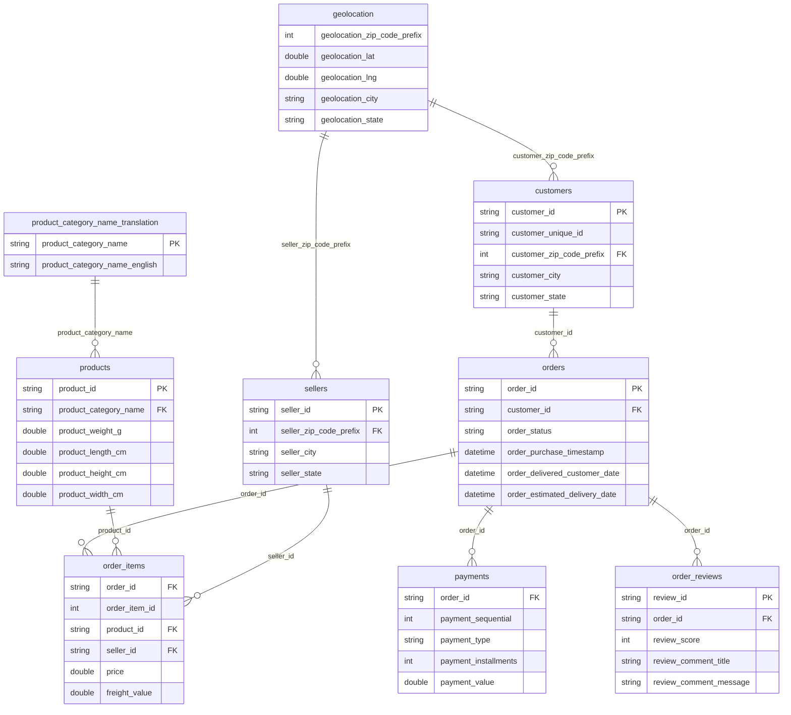
```mermaid
erDiagram
    customers ||--o{ orders : "customer_id"
    orders ||--o{ order_items : "order_id"
    products ||--o{ order_items : "product_id"
    sellers ||--o{ order_items : "seller_id"
    orders ||--o{ payments : "order_id"
    orders ||--o{ order_reviews : "order_id"
    product_category_name_translation ||--o{ products : "product_category_name"
    geolocation ||--o{ customers : "customer_zip_code_prefix"
    geolocation ||--o{ sellers : "seller_zip_code_prefix"

    customers {
        string customer_id PK
        string customer_unique_id
        int customer_zip_code_prefix FK
        string customer_city
        string customer_state
    }

    orders {
        string order_id PK
        string customer_id FK
        string order_status
        datetime order_purchase_timestamp
        datetime order_delivered_customer_date
        datetime order_estimated_delivery_date
    }

    order_items {
        string order_id FK
        int order_item_id
        string product_id FK
        string seller_id FK
        double price
        double freight_value
    }

    products {
        string product_id PK
        string product_category_name FK
        double product_weight_g
        double product_length_cm
        double product_height_cm
        double product_width_cm
    }

    sellers {
        string seller_id PK
        int seller_zip_code_prefix FK
        string seller_city
        string seller_state
    }

    payments {
        string order_id FK
        int payment_sequential
        string payment_type
        int payment_installments
        double payment_value
    }

    order_reviews {
        string review_id PK
        string order_id FK
        int review_score
        string review_comment_title
        string review_comment_message
    }

    geolocation {
        int geolocation_zip_code_prefix
        double geolocation_lat
        double geolocation_lng
        string geolocation_city
        string geolocation_state
    }

    product_category_name_translation {
        string product_category_name PK
        string product_category_name_english
    }
```

### 4.3 预处理步骤

数据预处理主要包括：

1. 字段类型规范化：将订单时间、支付时间、评论时间等字段转换为日期时间类型，将价格、运费、评分等字段转换为数值类型。
2. 多表拆分与入库：将 Olist 数据拆分并写入 MySQL 中的 9 张业务表，保证主外键字段可用于 JOIN。
3. 缺失值处理：配送时间为空的订单不参与准时率和配送时长计算；评论文本为空的记录不参与 NLP 文本分析。
4. 品类翻译处理：通过 `product_category_name_translation` 将葡萄牙语品类名映射为英文品类名，若无翻译则保留原始品类。
5. 业务口径过滤：预聚合视图中销售、配送和支付分析主要保留 `order_status = 'delivered'` 的已完成订单。
6. 构建预聚合视图层：根据高频分析维度生成 6 张物化汇总表，减少实时多表 JOIN 的成本。

## 5. 预聚合视图设计专节

### 5.1 视图清单与 Agent 使用方式

| 视图名 | 粒度 | 核心字段 | Agent 使用场景 |
|---|---|---|---|
| `mv_monthly_sales` | `ym` | `total_gmv`, `total_orders`, `avg_basket`, `total_freight` | 月度销售趋势、GMV、预测模型输入 |
| `mv_state_sales` | `ym + customer_state` | `total_gmv`, `total_orders`, `unique_customers` | 各州销售额排名、区域市场对比、地图展示 |
| `mv_category_sales` | `ym + product_category_english` | `total_gmv`, `total_orders`, `avg_price` | 品类销售表现、Top 品类分析 |
| `mv_delivery_perf` | `ym + customer_state` | `avg_delivery_days`, `on_time_rate`, `delayed_orders` | 准时交付率、配送延迟诊断 |
| `mv_seller_perf` | `ym + seller_id` | `seller_state`, `total_gmv`, `total_orders`, `avg_review_score` | 卖家绩效、低评分卖家定位、What-if 筛选 |
| `mv_payment_dist` | `ym + payment_type` | `total_transactions`, `avg_installments`, `total_value` | 支付方式偏好、分期模式分析 |

Data Analyst Agent 的系统提示词中明确写入“View-first strategy”：凡是用户问题匹配到视图粒度，就必须优先查询 `mv_*` 预聚合视图；只有当视图无法覆盖维度时，才回退基础表。例如商品重量与运费关系需要 `products.product_weight_g` 与 `order_items.freight_value` 的明细关系，因此回退基础表；而月度销售、州级销售、支付方式、配送准时率等问题则优先使用视图。

### 5.2 SQL 定义

#### 5.2.1 `mv_monthly_sales`

```sql
DROP TABLE IF EXISTS mv_monthly_sales;
CREATE TABLE mv_monthly_sales (
    ym VARCHAR(7) PRIMARY KEY,
    total_gmv DOUBLE,
    total_orders BIGINT,
    avg_basket DOUBLE,
    total_freight DOUBLE
);

INSERT INTO mv_monthly_sales (ym, total_gmv, total_orders, avg_basket, total_freight)
SELECT
    DATE_FORMAT(o.order_purchase_timestamp, '%Y-%m') AS ym,
    SUM(oi.price) AS total_gmv,
    COUNT(DISTINCT o.order_id) AS total_orders,
    ROUND(SUM(oi.price) / COUNT(DISTINCT o.order_id), 2) AS avg_basket,
    SUM(oi.freight_value) AS total_freight
FROM orders o
JOIN order_items oi ON o.order_id = oi.order_id
WHERE o.order_status = 'delivered'
GROUP BY ym
ORDER BY ym;
```

#### 5.2.2 `mv_state_sales`

```sql
DROP TABLE IF EXISTS mv_state_sales;
CREATE TABLE mv_state_sales (
    ym VARCHAR(7),
    customer_state VARCHAR(8),
    total_gmv DOUBLE,
    total_orders BIGINT,
    unique_customers BIGINT,
    PRIMARY KEY (ym, customer_state)
);

INSERT INTO mv_state_sales (ym, customer_state, total_gmv, total_orders, unique_customers)
SELECT
    DATE_FORMAT(o.order_purchase_timestamp, '%Y-%m') AS ym,
    c.customer_state,
    SUM(oi.price) AS total_gmv,
    COUNT(DISTINCT o.order_id) AS total_orders,
    COUNT(DISTINCT c.customer_unique_id) AS unique_customers
FROM orders o
JOIN order_items oi ON o.order_id = oi.order_id
JOIN customers c ON o.customer_id = c.customer_id
WHERE o.order_status = 'delivered'
GROUP BY ym, c.customer_state
ORDER BY ym, c.customer_state;
```

#### 5.2.3 `mv_category_sales`

```sql
DROP TABLE IF EXISTS mv_category_sales;
CREATE TABLE mv_category_sales (
    ym VARCHAR(7),
    product_category_english VARCHAR(256),
    total_gmv DOUBLE,
    total_orders BIGINT,
    avg_price DOUBLE,
    PRIMARY KEY (ym, product_category_english)
);

INSERT INTO mv_category_sales (ym, product_category_english, total_gmv, total_orders, avg_price)
SELECT
    DATE_FORMAT(o.order_purchase_timestamp, '%Y-%m') AS ym,
    COALESCE(t.product_category_name_english, p.product_category_name) AS product_category_english,
    SUM(oi.price) AS total_gmv,
    COUNT(DISTINCT o.order_id) AS total_orders,
    ROUND(AVG(oi.price), 2) AS avg_price
FROM orders o
JOIN order_items oi ON o.order_id = oi.order_id
JOIN products p ON oi.product_id = p.product_id
LEFT JOIN product_category_name_translation t ON p.product_category_name = t.product_category_name
WHERE o.order_status = 'delivered'
GROUP BY ym, product_category_english
ORDER BY ym, product_category_english;
```

#### 5.2.4 `mv_delivery_perf`

```sql
DROP TABLE IF EXISTS mv_delivery_perf;
CREATE TABLE mv_delivery_perf (
    ym VARCHAR(7),
    customer_state VARCHAR(8),
    avg_delivery_days DOUBLE,
    on_time_rate DOUBLE,
    delayed_orders BIGINT,
    PRIMARY KEY (ym, customer_state)
);

INSERT INTO mv_delivery_perf (ym, customer_state, avg_delivery_days, on_time_rate, delayed_orders)
SELECT
    DATE_FORMAT(o.order_purchase_timestamp, '%Y-%m') AS ym,
    c.customer_state,
    ROUND(AVG(DATEDIFF(o.order_delivered_customer_date, o.order_purchase_timestamp)), 1) AS avg_delivery_days,
    ROUND(
        SUM(CASE WHEN o.order_delivered_customer_date <= o.order_estimated_delivery_date THEN 1 ELSE 0 END)
        / COUNT(*) * 100, 1
    ) AS on_time_rate,
    SUM(CASE WHEN o.order_delivered_customer_date > o.order_estimated_delivery_date THEN 1 ELSE 0 END) AS delayed_orders
FROM orders o
JOIN customers c ON o.customer_id = c.customer_id
WHERE o.order_status = 'delivered'
  AND o.order_delivered_customer_date IS NOT NULL
  AND o.order_estimated_delivery_date IS NOT NULL
GROUP BY ym, c.customer_state
ORDER BY ym, c.customer_state;
```

#### 5.2.5 `mv_seller_perf`

```sql
DROP TABLE IF EXISTS mv_seller_perf;
CREATE TABLE mv_seller_perf (
    ym VARCHAR(7),
    seller_id VARCHAR(64),
    seller_state VARCHAR(8),
    total_gmv DOUBLE,
    total_orders BIGINT,
    avg_review_score DOUBLE,
    PRIMARY KEY (ym, seller_id)
);

INSERT INTO mv_seller_perf (ym, seller_id, seller_state, total_gmv, total_orders, avg_review_score)
SELECT
    DATE_FORMAT(o.order_purchase_timestamp, '%Y-%m') AS ym,
    s.seller_id,
    s.seller_state,
    SUM(oi.price) AS total_gmv,
    COUNT(DISTINCT o.order_id) AS total_orders,
    ROUND(AVG(r.review_score), 2) AS avg_review_score
FROM orders o
JOIN order_items oi ON o.order_id = oi.order_id
JOIN sellers s ON oi.seller_id = s.seller_id
LEFT JOIN order_reviews r ON o.order_id = r.order_id
WHERE o.order_status = 'delivered'
GROUP BY ym, s.seller_id, s.seller_state
ORDER BY ym, s.seller_id;
```

#### 5.2.6 `mv_payment_dist`

```sql
DROP TABLE IF EXISTS mv_payment_dist;
CREATE TABLE mv_payment_dist (
    ym VARCHAR(7),
    payment_type VARCHAR(32),
    total_transactions BIGINT,
    avg_installments DOUBLE,
    total_value DOUBLE,
    PRIMARY KEY (ym, payment_type)
);

INSERT INTO mv_payment_dist (ym, payment_type, total_transactions, avg_installments, total_value)
SELECT
    DATE_FORMAT(o.order_purchase_timestamp, '%Y-%m') AS ym,
    p.payment_type,
    COUNT(*) AS total_transactions,
    ROUND(AVG(p.payment_installments), 1) AS avg_installments,
    SUM(p.payment_value) AS total_value
FROM orders o
JOIN payments p ON o.order_id = p.order_id
WHERE o.order_status = 'delivered'
GROUP BY ym, p.payment_type
ORDER BY ym, p.payment_type;
```

### 5.3 性能对比

本项目选择同一业务问题进行性能对比：**2017 年各州销售额排名**。

| 查询方式 | SQL 来源 | 中位耗时 | 平均耗时 | 返回州数 |
|---|---|---:|---:|---:|
| 预聚合视图查询 | `mv_state_sales` | 30.49 ms | 54.96 ms | 27 |
| 基础表实时 JOIN | `orders + order_items + customers` | 363.98 ms | 371.41 ms | 27 |

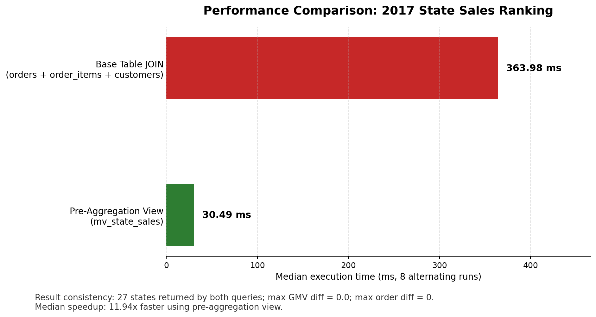

两种查询返回结果完全一致：均返回 27 个州，GMV 最大差异为 0.0，订单数最大差异为 0。预聚合视图约快 11.94 倍，说明提前按业务粒度汇总能够显著降低 Agent 查询过程中的实时 JOIN 和 GROUP BY 成本。

预聚合视图 SQL：

```sql
SELECT
    customer_state,
    ROUND(SUM(total_gmv), 2) AS total_gmv,
    SUM(total_orders) AS total_orders
FROM mv_state_sales
WHERE ym LIKE '2017%'
GROUP BY customer_state
ORDER BY total_gmv DESC;
```

基础表 JOIN SQL：

```sql
SELECT
    c.customer_state,
    ROUND(SUM(oi.price), 2) AS total_gmv,
    COUNT(DISTINCT o.order_id) AS total_orders
FROM orders o
JOIN order_items oi ON o.order_id = oi.order_id
JOIN customers c ON o.customer_id = c.customer_id
WHERE o.order_status = 'delivered'
  AND o.order_purchase_timestamp >= '2017-01-01'
  AND o.order_purchase_timestamp < '2018-01-01'
GROUP BY c.customer_state
ORDER BY total_gmv DESC;
```

## 6. 智能体实现和多智能体调度方法

### 6.1 Agent 角色设计

| Agent | 主要职责 | 输入 | 输出 |
|---|---|---|---|
| Coordinator Agent | 理解自然语言问题，判断分析类型，生成任务计划 | 用户问题、上下文 | `analysis_type`, `task_plan` |
| Data Analyst Agent | 根据问题生成 SQL，优先命中预聚合视图，必要时回退基础表 | 子任务、数据字典、视图说明 | SQL、查询结果、数据摘要、查询策略 |
| NLP Insight Agent | 对评论文本做情感分析、主题提取和决策信号总结 | 评论文本、评分、品类 | 正负面比例、差评主题、关键词、行动建议 |
| Predictor Agent | 基于历史月度销售序列预测未来销售趋势 | `mv_monthly_sales` | 预测值、置信区间、趋势方向 |
| Scenario Agent | 运行 What-if 卖家筛选和异常检测 | 用户问题、数据结果、视图指标 | What-if 模拟结果、异常告警 |
| Visualizer Agent | 选择图表类型并生成图表 | 数据结果、问题类型 | 折线图、柱状图、地图、热力图、散点图、词云等 |
| Decision Agent | 融合数据、预测、NLP 和场景分析，给出运营建议 | 各 Agent 中间结果 | 业务解释、风险提示、行动方案 |
| Synthesis | 汇总最终回答 | 全部状态 | Markdown 格式最终输出 |

### 6.2 调度逻辑

系统使用 LangGraph 的 `StateGraph` 定义节点和边。各 Agent 共享 `AgentState`，其中包含用户问题、任务计划、SQL 结果、NLP 结果、预测结果、场景分析结果、图表路径、决策建议和最终回答。

调度逻辑包括：

1. 用户提交问题后，记忆模块先判断是否为追问。如果问题中出现“这些州”“刚才的卖家”“继续分析”等表达，则将上一轮的重点实体和结论注入当前问题。
2. Coordinator Agent 生成任务计划，并判断问题属于描述性、诊断性、预测性或规范性分析。
3. Data Analyst Agent 执行数据查询。若命中预聚合视图粒度，则使用 `mv_*`；否则使用基础表 JOIN。
4. 路由函数根据问题关键词决定是否触发 NLP、预测或场景分析。
5. Visualizer Agent 根据问题和结果自动选择图表。
6. Decision Agent 将数据摘要、NLP 主题、预测结果、What-if 结果和异常告警整合为业务建议。
7. Synthesis 输出最终回答，Streamlit 将回答、图表、加分项结果和原始数据分别展示在不同页签。

### 6.3 加分功能实现

评论文本情感分析与主题建模：NLP Insight Agent 从 `order_reviews` 读取评论文本，结合评分划分正负面评论，计算平均评分、正负面比例，并通过关键词规则提取物流延迟、商品质量、错发漏发、客服退款、价格感知等主题，最终将主题转化为 Decision Agent 可使用的决策信号。

What-if 分析：Scenario Agent 检测到 “what-if / 如果 / 移除 / 筛选卖家” 等问题后，调用 `what_if_remove_worst_sellers`，基于 `mv_seller_perf` 找出低评分卖家，估算移除后平台平均评分变化和 GMV 风险。

异常检测 Agent：异常检测模块对月度 GMV、州级销售额下降和品类评分下降进行扫描，使用 z-score、历史均值对比和评分下降阈值生成告警，并给出 action hint。

记忆模块：系统通过 MemorySaver 和自定义 thread memory 保存上一轮问题、重点州、重点卖家、场景分析结果和建议摘要，使后续追问能够关联上一轮分析对象。

## 7. 运行结果截图、分析解释及决策建议解读

### 7.1 系统首页与自然语言问答

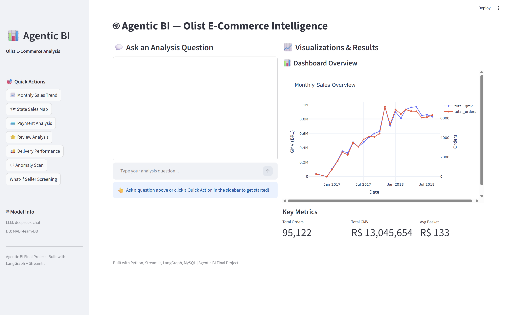

系统首页采用左侧快捷操作与自然语言输入、右侧可视化结果展示的双栏布局。用户可以直接点击 Quick Actions，也可以输入中文业务问题。

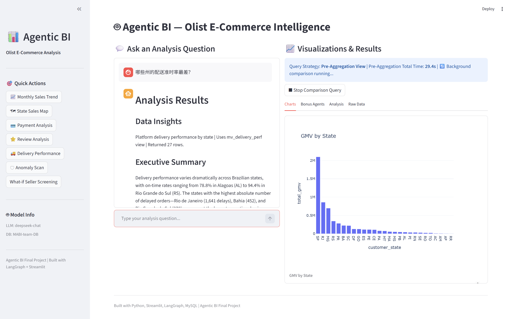

自然语言问答结果展示了 Agent 能够理解业务问题，自动生成分析回答，并在右侧展示可视化结果。

### 7.2 SQL 结果与原始数据展示

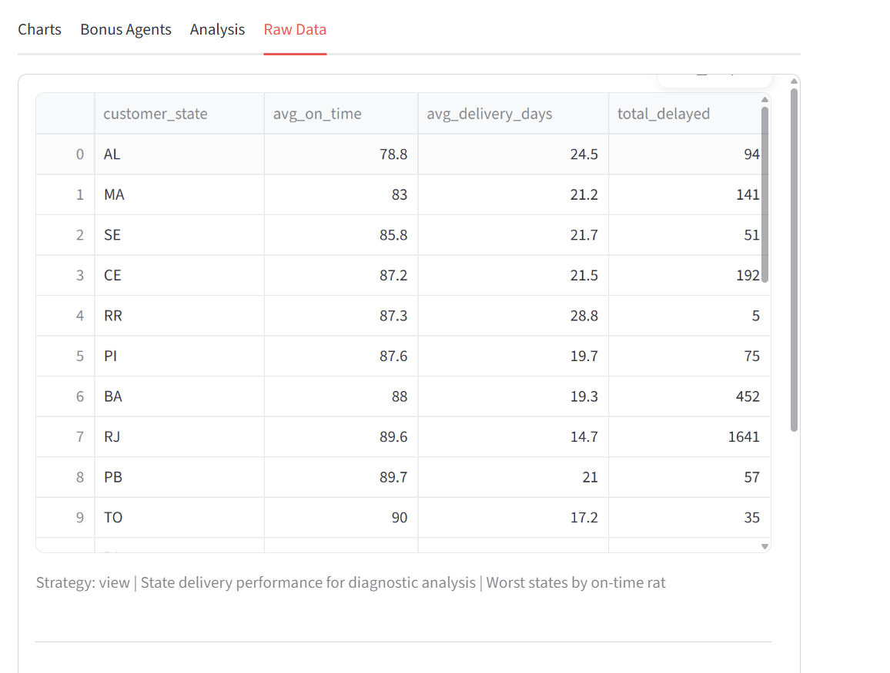

Raw Data 页签用于展示 Data Analyst Agent 返回的结构化查询结果，便于验证 SQL 输出和图表数据来源。

### 7.3 至少 6 类可视化图表

#### 7.3.1 月度销售趋势折线图

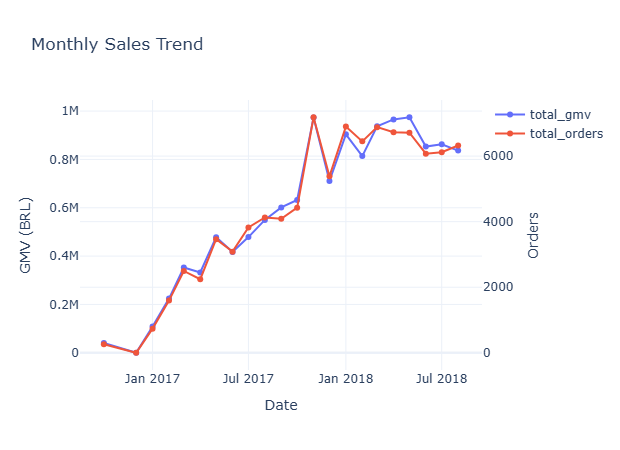

月度销售趋势图基于 `mv_monthly_sales`，用于观察 GMV 与订单量随时间变化的趋势，是预测模型的主要历史输入。

#### 7.3.2 巴西州销售地图与州级柱状图

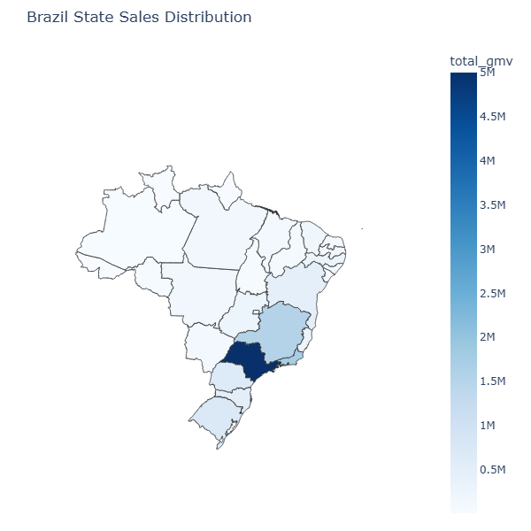

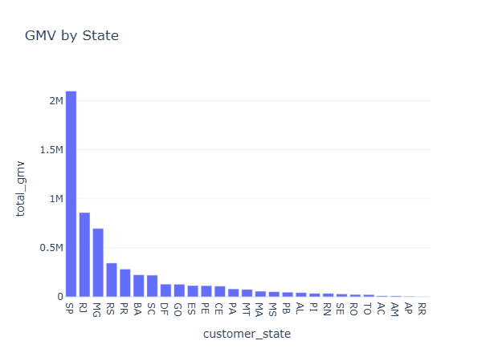

州级地图和柱状图基于 `mv_state_sales` 和地理信息，展示不同州的销售规模差异。SP、RJ、MG 等州通常贡献较高 GMV，适合用于区域运营资源配置。

#### 7.3.3 支付方式柱状图

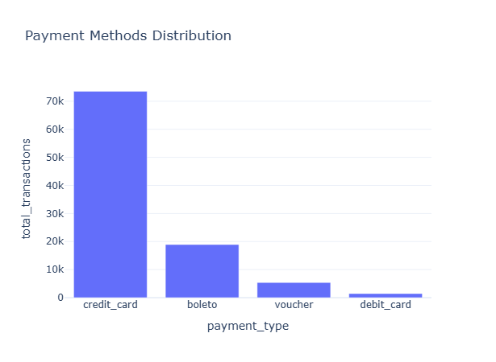

支付方式柱状图基于 `mv_payment_dist`，展示信用卡、boleto、voucher、debit card 等支付方式的使用频率，有助于分析支付偏好。

#### 7.3.4 支付方式 × 分期数热力图

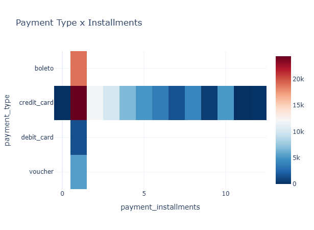

热力图展示支付方式与分期数之间的交叉分布，可用于识别信用卡分期行为和支付结构特点。

#### 7.3.5 商品重量 vs 运费散点 / 气泡图

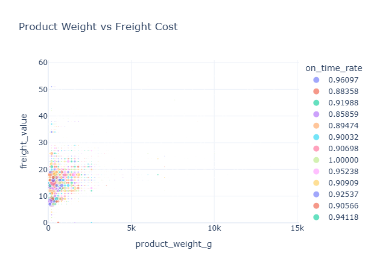

该图通过基础表 `products` 与 `order_items` 进行 JOIN，分析商品重量与运费之间的关系。由于商品重量不在预聚合视图中，该问题体现了 Agent 的基础表回退机制。

#### 7.3.6 评论词云与评论主题表

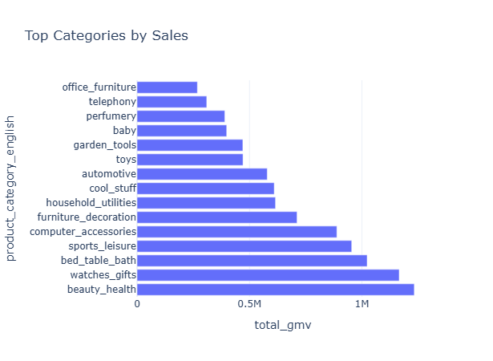

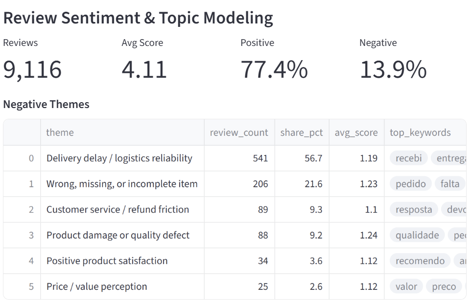

评论词云和主题表展示了评论文本中高频主题。负面主题集中在物流延迟、错发漏发、客服退款、商品损坏等方面，为后续运营改进建议提供了非结构化文本依据。

### 7.4 预测分析结果

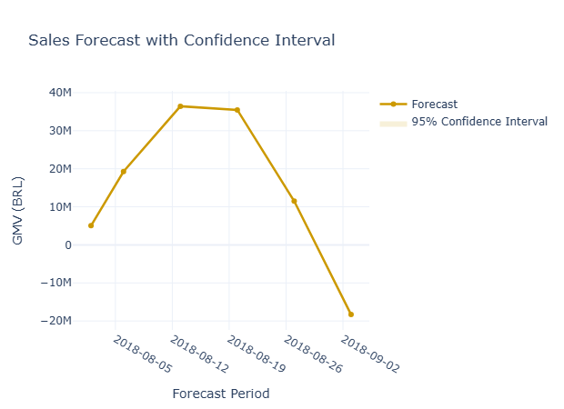

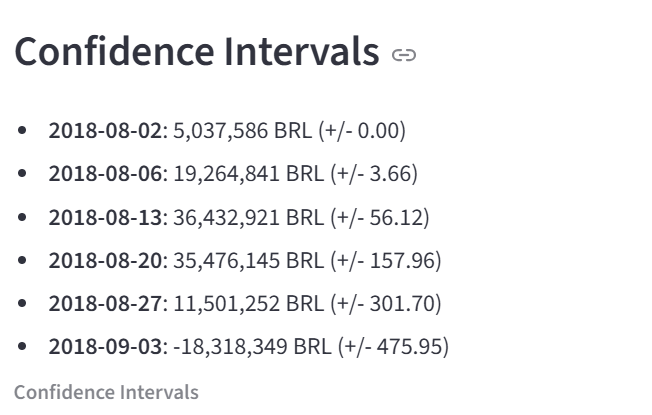

预测模块基于 `mv_monthly_sales` 的历史序列训练 Prophet 模型，输出未来周期的销售预测值和置信区间。置信区间用于提示预测结果的不确定性，避免将预测值误解为确定结果。

### 7.5 评论情感分析与主题建模

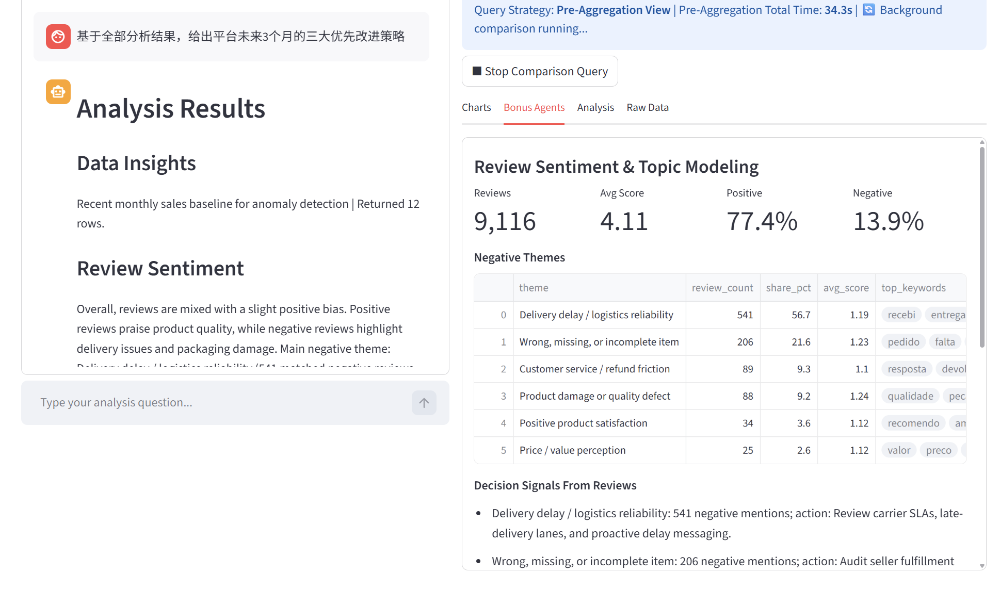

评论情感分析显示系统统计了评论总数、平均评分、正负面比例，并提取主要差评主题。结果不是只停留在评分统计，而是进一步将“物流延迟”“错发漏发”“客服退款”等文本主题转化为决策输入。

### 7.6 What-if 分析

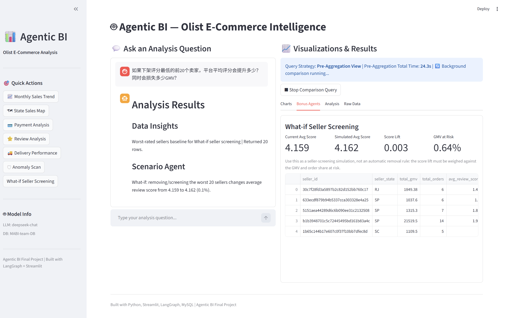

What-if 卖家筛选用于回答“如果移除评分最低的卖家，平台评分和 GMV 风险会如何变化”。该功能帮助业务人员在执行卖家治理前，先估算潜在收益和损失。

### 7.7 异常检测 Agent

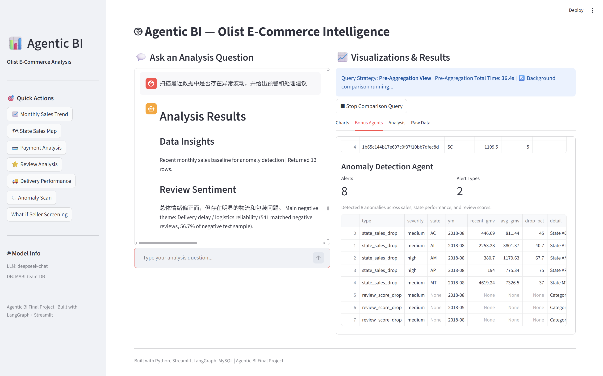

异常检测 Agent 自动扫描销售、州级表现和评分变化中的异常点，输出告警数量、类型、异常详情和处理建议，适合作为运营监控入口。

### 7.8 多轮记忆与关联追问

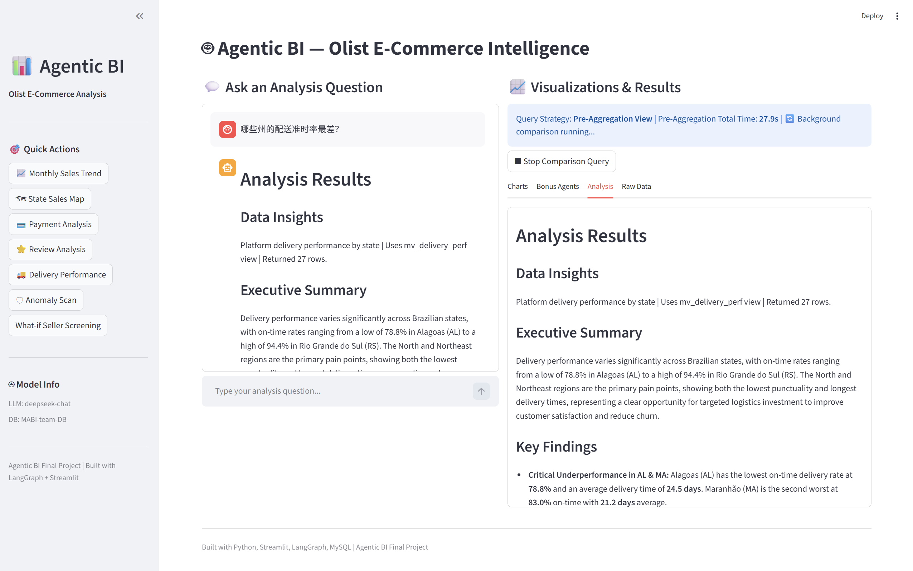

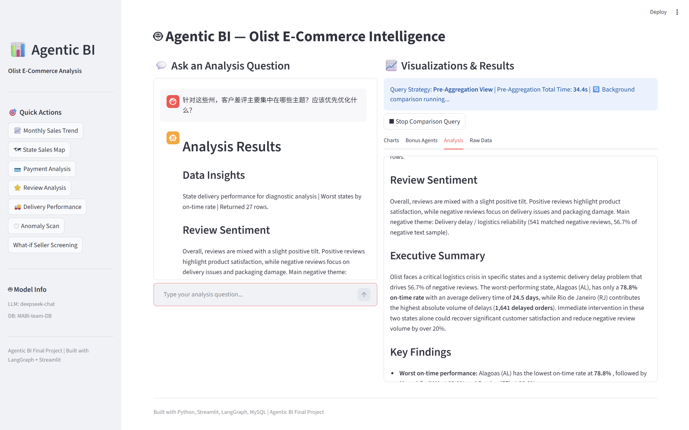

多轮记忆模块使系统能够在后续问题中引用上一轮分析对象。例如用户先询问某些州或卖家，再继续追问“这些州的配送表现如何”，系统可以结合上一轮重点实体进行关联分析。

### 7.9 决策建议

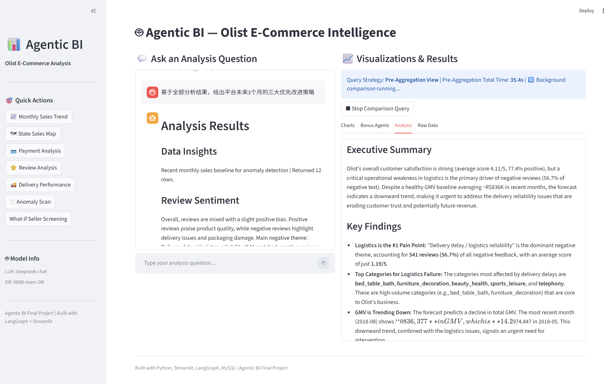

Decision Agent 将数据查询、评论主题、预测结果和场景分析综合为运营建议。例如针对物流延迟主题，可建议复核承运商 SLA、建立延迟订单预警和主动通知机制；针对低评分卖家，可建议分层治理而非直接大规模下架，以控制 GMV 风险。

## 8. 技术挑战与解决方案

| 技术挑战 | 表现 | 解决方案 |
|---|---|---|
| 多表 JOIN 查询成本高 | 订单、商品、客户、支付、评论等表频繁 JOIN，交互式分析容易变慢 | 设计 6 张预聚合视图，将高频分析维度提前物化 |
| LLM 生成 SQL 容易选错表或字段 | 例如把 `customer_state` 写到 `orders` 表，或使用 PostgreSQL 语法 | 在 Data Analyst Prompt 中加入字段归属表、MySQL 语法规则和 view-first checklist |
| 预聚合视图与基础表结果需一致 | 性能优化不能牺牲结果准确性 | 使用同一问题对比视图 SQL 和基础表 JOIN SQL，校验州数、GMV 和订单数差异为 0 |
| 中文自然语言和英文数据字段之间存在语义映射 | 用户输入中文，数据库字段和品类多为英文或葡萄牙语 | Coordinator 识别中文意图，Data Analyst 使用数据字典和视图说明映射到 SQL |
| 评论文本为葡萄牙语 | 直接中文关键词无法分析评论 | 对评论文本进行规范化、葡萄牙语关键词提取，并结合 LLM 生成主题摘要 |
| What-if 结果不能由 LLM 编造 | 业务场景需要可解释和可复现的数值 | Scenario Agent 直接从 `mv_seller_perf` 和明细数据计算评分变化与 GMV 风险 |
| 多轮追问容易污染普通问题 | 如果无条件注入历史上下文，会导致不相关问题误触发 Agent | 只在判断为 follow-up 问题时使用 memory context，普通问题保持独立 |
| 前端结果较多，页面容易拥挤 | 图表、原始数据、加分项和分析文本同时展示 | 使用 Charts、Bonus Agents、Analysis、Raw Data 页签分区展示，并为右侧结果区设置滚动容器 |

## 9. 小组分工和比例

| 学号 | 姓名 | 分工 | 占比 |
|---|---|---|---:|
| 2354283 | 黄迪 | 数据建模、9 张表关系梳理、预聚合视图设计与 SQL 编写、性能对比测试 | 33% |
| 2351269 | 黄一和 | 系统集成、LangGraph Agent 编排、Data Analyst / NLP / Scenario / Decision Agent 实现、可视化图表生成 | 33% |
| 2352048 | 夏浩博 | Streamlit 前端交互、演示材料整理、截图整理、项目报告统筹与最终打包 | 33% |

## 10. 总结

本项目完成了一个可运行的 Agentic BI 电商运营分析系统。系统能够通过自然语言完成多表数据查询、预聚合视图加速、自动可视化、销售预测、评论情感分析、What-if 模拟、异常检测和多轮关联分析。与传统静态 BI 报表相比，本系统更强调“问题驱动”的分析过程：用户无需直接编写 SQL，系统即可根据问题自动选择视图、查询数据、生成图表并给出可执行建议。

从实验结果看，预聚合视图层显著提升了查询效率，在“2017 年各州销售额排名”任务中获得约 11.94 倍加速，同时保持结果一致。该设计证明，在 Agentic BI 场景下，将 LLM Agent 与稳定的数据建模和预聚合视图结合，可以同时兼顾自然语言交互的灵活性和数据分析结果的可靠性。
